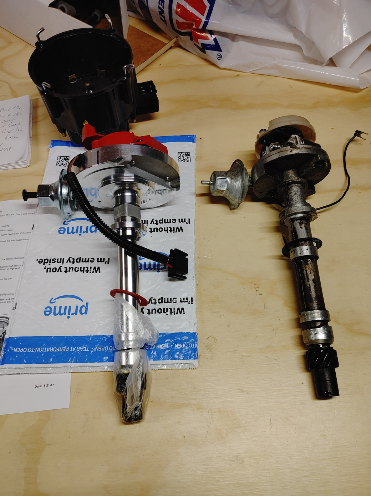

<div align="center">
    
</div>

## Process
This is a somewhat involved project which required going through a number of forums, sites, and manuals. This is my attempt to combine as much info I could in one spot with notes from doing it. The route I took was to find TDC, remove the old power wire, run the new power wire, swap in the new HEI unit, connect power wire, and then work on setting timing. I had to start and stop this project a number of times to research different aspects. I was unable to find any pictures or videos of the bulkhead connector for example and photos with explanation of this have been included. 

  ```mermaid
flowchart TD
  A[Find Top Dead Center]
  B[Building & Running New Power Wire - Part 1]
  C[Remove Original Distributor]
  D[Install HEI Distributor]
  E[Building & Running New Power Wire - Part 2]
  F[Set Engine Timing]
  A --> B
  B --> C
  C --> D
  D --> E
  E --> F
  
```
<div align="center">
  <strong>Chart Showing Process to Migrate from Points to HEI</strong>
</div>
<br/>
 
 ### Main Steps
 * [Finding Top Dead Center](ProcessFindingTDC.md)
 * [Building & Running New Power Wire](ProcessRunningWire.md)
 * [Removing Distributor](ProcessRemovingDistributor.md)
 * [Installing HEI Distributor](ProcessInstallingDistributor.md)
 * [Setting Timing](ProcessSettingTiming.md)
