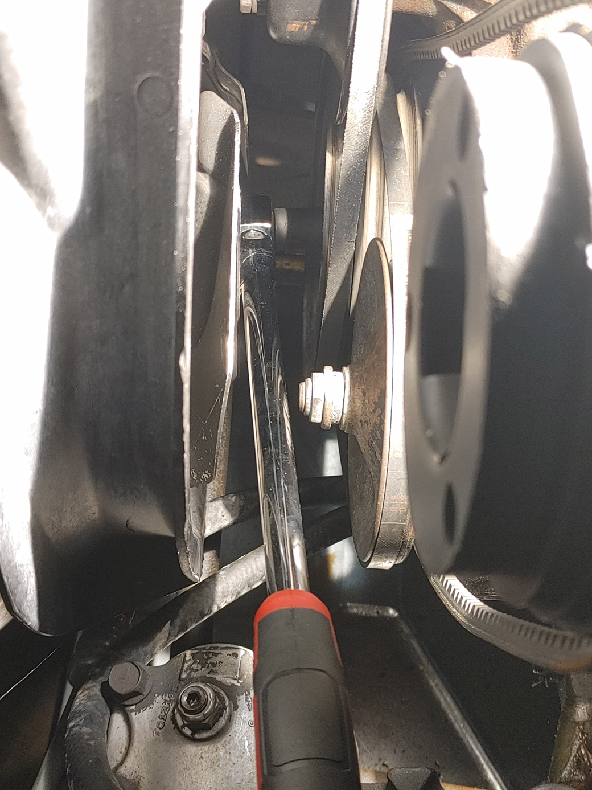
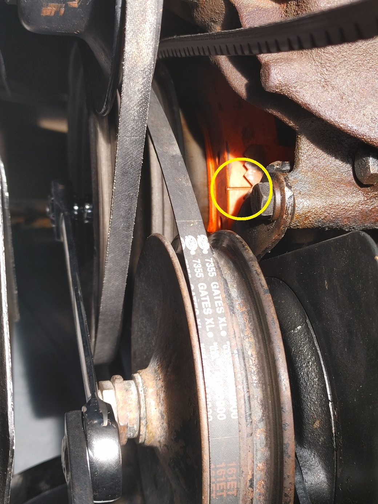

## Finding Top Dead Center (TDC)
1. Disconnect or verify that the battery is disconnected. 
2. Remove all spark plugs.
3. Loosen all accessories so that there is no drag on the crankshaft and balancer from the accessory belts. 

    

4. Use a long arm rachet wrench (ideally with a flex head and at least 18 in long) and a socket.
5. Crank over motor manually using the long arm wrench. 
6. As timing mark seems to be approaching motors 0 deg timing place a finger or thumb over the Number 1 spark plug port.

    

7. Keep turning motor over with wrench. You should start to feel pressure building on your finger. If pressure is building, you are on the compression stroke. If pressure is not building, you are 180 deg out of time and need to keep turning the engine over with the wrench. Till you get compression at the timing mark
