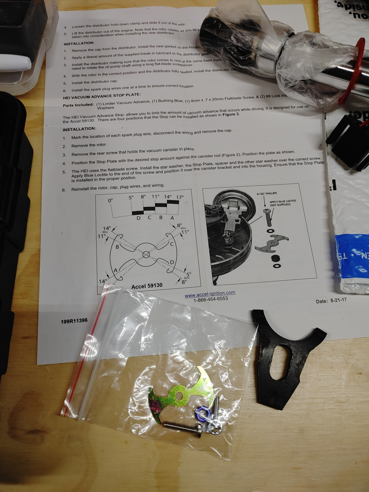
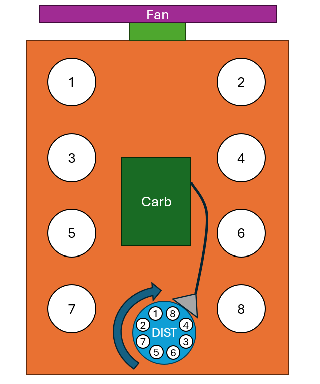
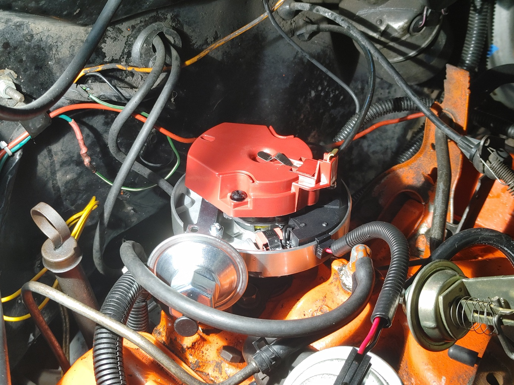

## Installing New Distributor
### Overview
The goal here is to get the new unit full seated with the rotor aligned close to spark plug number 1 on the cap such that the vacuum advance canister clears other engine components with enough play so that timing can be adjust by rotating the distributor. 

### Steps
 1. For a stock 350 using C on the vac limiter plate can be a good starting point. I had to move to B on the plate to get enough advance at idle when attached to ported. Use Thread locker, Blue on the fastener that holds the limiter plate.  This plate is shown in Figure 1. 

    

  <strong>Figure 1. Vacuum Advance Limiter Plate and Instructions</strong>

 

 2. Be sure to apply the assembly lube that the distributor comes with to the helical sprocket at the bottom of the distributor. 

 3. Test fitting the distributor. Remove the cap. The goal here to check installation to get the distributor rotor to be pointing to a spark plug wire connection terminal while having the vac advance the ability to rotate some and not be blocked by components. Typically, you can try to get the spark plug terminal number 1 to be forward and off set a few degrees toward the driver side and the vac advance to be sort of 45 deg off from the centerline of the vehicle. You will need to twist the distributor some the opposite way it was twisted when removing the previous one, to get it to go in as the helical gears seat. The figure below shows cylinder numbers and rough orientation of the distributor. When installed the rotor needs to be roughly aligned with Number 1 shown on the Figure 2 diagram. 

    

  <strong>Figure 2. Diagram Showing Engine Cylinder Numbering and Distributor Alignment</strong>

 

 4. If it will not seat fully you need to align the oil pump shaft with the distributor gear bottoms slot. To do this use a long flat head screwdriver to twist the oil pump shaft with. Test fit again till the distributor sits flush. Be sure to use a large light (so that if dropped it can’t fall in) and long enough screwdriver such that it can’t fully fall in. See Figure 3 showing example of fully seated. 

    

  <strong>Figure 3. HEI Distributor Seated with Cap Off Showing Orientation of Rotor and Vacuum Advance</strong>

 

 5. With distributor seated, reinstall hold down clamp and bolt, but keep the clamp loose enough such that the distributor can be rotated but not such that engine vibrations might rotate it. 
 6. Start installing sparkplugs using anti-seize on threads. 
 7. Run and attach the spark plug wires. I found it best to lay them all out on table and then label them as they are for different lengths.
 8. Snug back all the accessories and visually inspect accessory belt routing. Check for belts not fully seated or aligned at each point they wrap on.
 9. Plug in the distributor power wire. 
 10. Attach battery cables. 
 11. Verify presence of fuel in the fuel tank.
