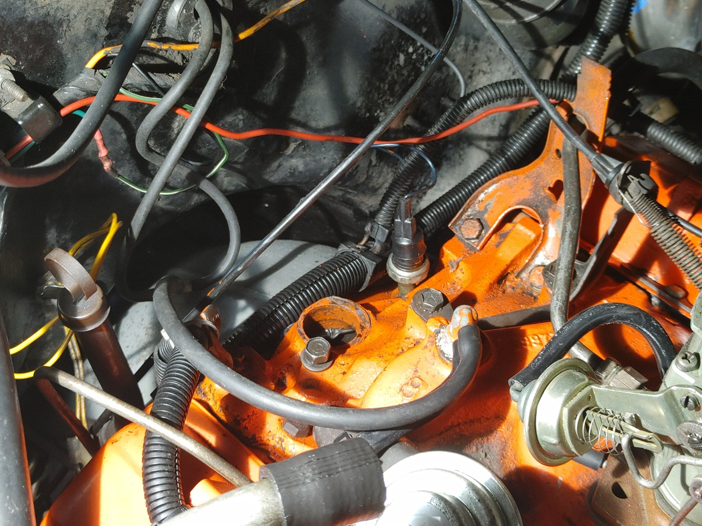

## Removing Existing Distributor
 1. Prior to starting removal, clean and wipe down area around the distributor. Goal is to clean the area as much as feasible and to reduce risks of dirt or lose debris from getting into the motor. 
 2. Once at 0 deg time. Remove the distributor hold down clamp using a flex head ratcheting box wrench. With the clamp removed, you can lift and twist the distributor out. 
 3. Once existing distributor is out, inspect and clean the gasketing surface.

    

 4. Clean the hold down clamp and bolt using a nylon or brass brush. Goal here is to remove debris and inspect threads on the bolt.
