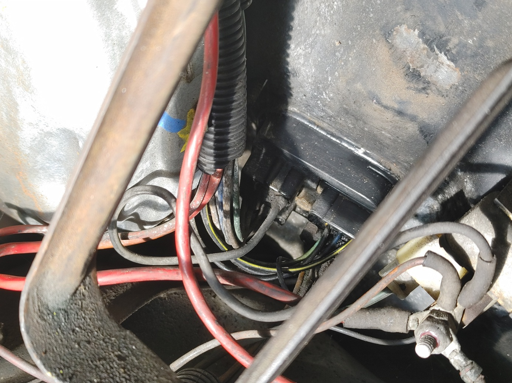
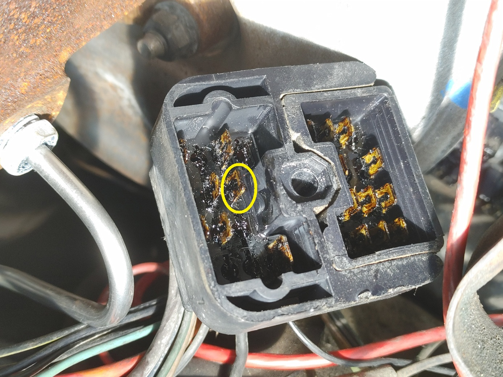
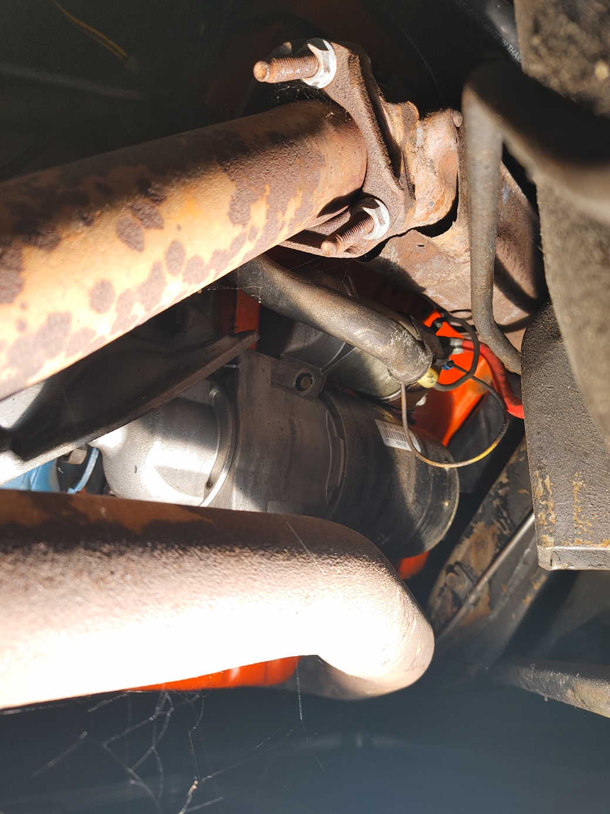
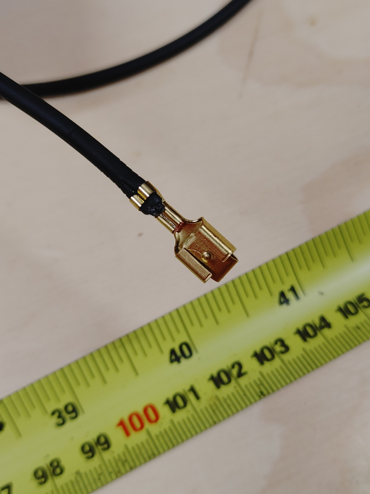
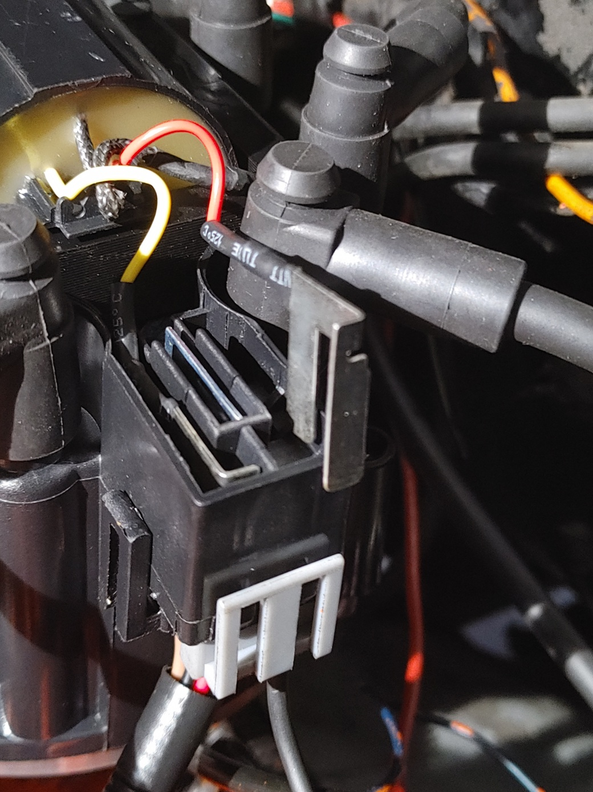

## Building & Running 14 awg Power Wire to the Distributor
 
### Background:
 The wiring diagram can be found page 12-50 (1087) of the factory workshop manual. Reproduction manuals can be sourced from David Graham. This diagram Figure 56 states a 20 AWG Black wire with Pink Print was used to power the factory distributor and coil. I had to scrub a bit on the cable with some engine degreaser and rag to verify the print color. This is shown as circuit 3 on the bulkhead connector and is named Primary Ignition Voltage - Dropping Resistor in the Electrical Circuit Identification Table on 12-48 (1085). Another wire shown at circuit 7, which is 20 AWG Yellow and named Primary Ignition Bypass. Circuit 7 runs from the factory distributor and coil to the starter. This circuit 7 wire is absent from factory HEI systems compared to in the 76 model year. I did not replace this one. 
 
### Finding the circuit we are replacing:
 From the factory this circuit terminates the bulkhead connector and the coil / distributor. 
 1. Disconnect or verify that the battery is disconnected.
 2. Locate the bulkhead connector on the diver side near the brake booster. You will need to remove the wiper fluid revisor to get access. 

    

 3. Spray area with electronics cleaner.

 4. Loose the harnesses that run into this connector. They largely route around the top of the brake booster. I found it helpful to temporarily unroute them from there to provide more slack. 

 5. Use "Extension, 3/8 in Drive, 10 in Long", "Universal Joint, 3/8 in Drive", "Ratchet Wrench, 3/8 in Drive," and an appropriate socket to remove the center bolt. Note this bolt is a custom shoulder bolt for this connector. Do not drop and do not lose. 

 6. Once fastener is out. Use small pry tool to help pull the bulkhead connector out. 

    

 7. The circuit we need is one of the central ones and it is circled in the image of it. 

 8. To remove the blade, clean out the goop. Once this is cleaned you can use needle nose plier to squeeze the blade and pull it out from the back side of the connector. The presence of dirt and sealing goo can make it hard or impossible to remove, be sure to pick it out of that specific blade. Once done it is easy to remove. 

 9. With the blade removed start tracing the wire all the way back to the distributor and coil. Disconnect here. 

    

 10. Move under the car on the passenger side and disconnect from the starter the other end of circuit 7 (the yellow wire). For my vehicle circuit 3 & 7 were combined in a single terminal on the coil. 
 
 11. With that removed use a tape measure to compare the length of black wire. We will need to be longer than this to reach the new unit, but if you measure out something shorter than this value you need to recheck what you are doing.
 
 12. Now to do some testing making a crimp on this wire. Cut off a small 3 inch length of the new wire "Wire, Stranded, 14 AWG, Black, SXL (Pico Wire 82143S)".
 
 13. Strip off a suitable amount on the wire with a wire stripper. 
 
 14. Use the crimp tool either a ratcheting with a single crimp die or a hand crimper and place the open barrel crimp terminal on the wire. 
 
 15. It took me a few tries to get the correct crimp. Iterating on force on the conductor and crimp force on the insulation portion of the crimp. Once you can do this correctly then move on.

 16. Cut the wire to length. I recorded a 72 in length for my run and I had 1 loop at the end. 

 17. Place "Crimp, Open Barrel, 14 AWG, Packard (Pico 1589PT)" and "Crimp, Open Barrel, 14 AWG, Packard (Pico 1599PT)" on each end.

    

 18. Apply "Grease, Dielectric Silicone" to the bulkhead connector position for the wire and insert the blade crimp into the bulkhead connector. 

 19. Apply "Grease, Dielectric Silicone" to the seam and back areas of the bulkhead connector. Goal here is to add some as an extra barrier to moisture and replace what may have been washed out by the contact cleaner before.

 20. Installed bulkhead connector and route bundles through their previous locations while routing the new cable through the looms. I found a small body clip type pry tool to be helpful in opening the T joints in the loom to run the new wire. 

 21. Once wire has been routed and looms are back in place attach the housing from the distributor power connector pig tail to the wire by inserting the female terminal. 

 22. At this point I paused this process and and started to remove and then install the new HEI unit. I came back to the last few steps after the HEI unit was installed. 

 23. Open the top cap of the distributor shown.

    

 24. Bend the blades slightly toward the center the distributor and test fit the connector. You will be looking for the blades to not pop up from inserting the power connector. 

 25. Reattach distributor cover. 

 26. Pull lightly on new power wire to verify secure attachment.

 27. If issues with connection check blade alignment. This had to be adjusted as we are using thicker terminals which align slightly differently than the ones the distributor and the pig tails use.
