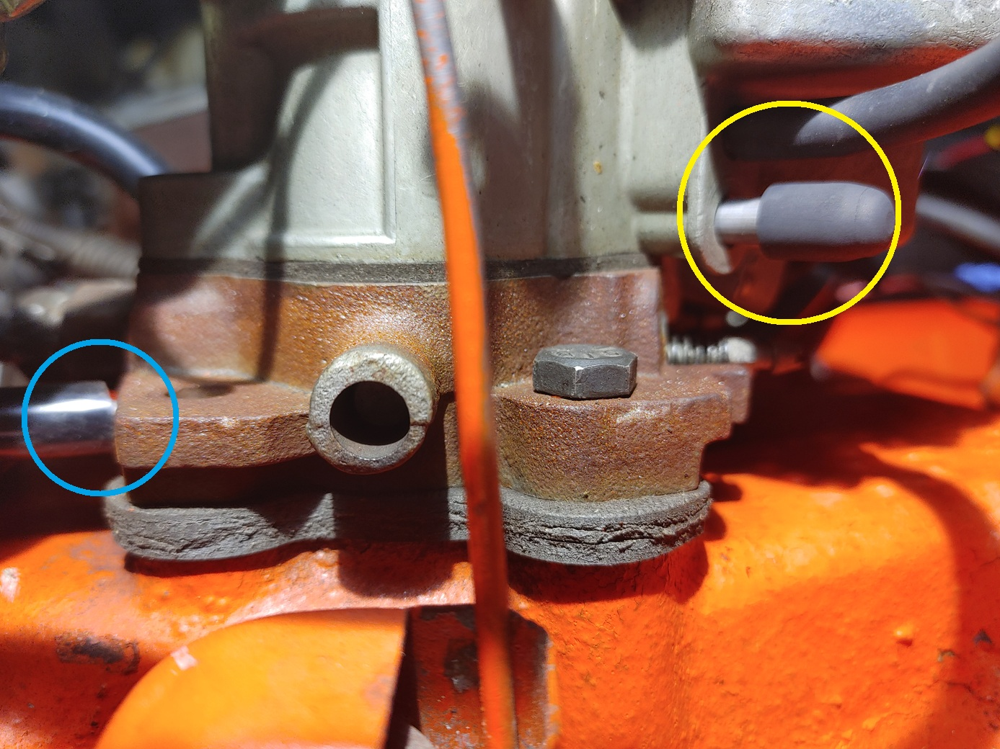
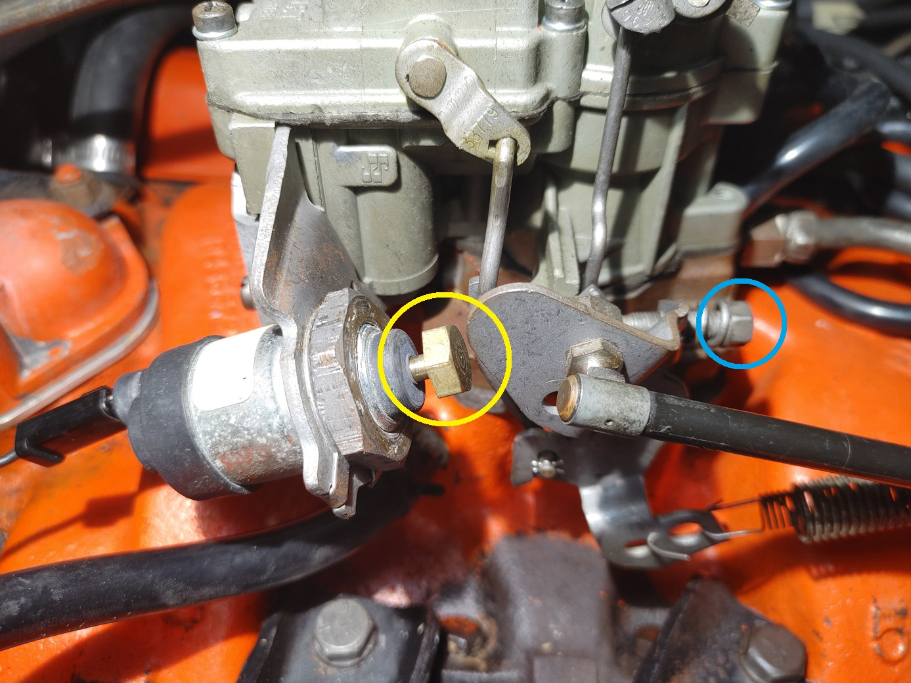

## Setting Timing
 A number of discussions will gravitate to this topic around higher performance applications and not a stock or daily driver context. The best route is to have an assistant’s help so that you can check timing with mechanical advance at a higher rpm. I did not have an assistant, so I took a modified good enough approach for my objective of getting the car back to turning over for the 1st time in nearly 2 yrs. 
 
### Some Background
#### The distributor has 3 forms of advance:
1. Base Offset: From rotating the distributor. You will see with the vehicle at idle and no vac connected.
2. Mechanical using weights and springs. This isn't really user adjustable, unless you start swapping out weights and springs. 
3. Vacuum based using the vac port to add more advance at idle or low rpms than what a mechanical advance will do. 
    
#### There are 3 options for vacuum when setting timing:
1. No vacuum: No line connected to the distributor and ports plugged.
2. Ported: From the carb above the vanes. This varies from low at idle to ramping up once the throttle starts moving. 
3. Manifold: From either on the manifold itself or from one of the lowest positions on the carb below the vanes. This is always high. 
    
#### There are 3 components of timing:
1. Base Offset: From rotating the distributor. You will see with the vehicle at idle and no vac connected. 
2. Mechanical: Nonadjustable by setup process.
3. Vacuum: Adjustable by changing orientation of stop plate to set the upper limit. 
    
#### Engine Run-On / Dieseling:
If you are getting this when you turn off the vehicle during this process. It comes from 3 main sources here.
1. Too high of idle rpm.
2. Not enough advance at idle. 
3. Improper position of idle stop solenoid screw. 
    
### Solo Approach
The approach I used without an assistant available who could rev the engine to 3k rpm, was to look at total timing at idle and try to get to that to line up as best I could.
1. Keep distributor vac port plugged and plug the port on carb which was connected to previous distributor. 
2. Attempt to crank car. You most likely may not be able to instantly start it if it has sat for a long period. it may take a few key turns. If more than a few key turns. try to rotate the distributor minor amounts in either direction. Between crank attempts. 
3. Once running connect timing light and adjust distributor timing by rotating till timing is at 12 deg. Once set turn off car. Snug down distributor hold down clamp / bolt. 
4. Connect vac line to manifold port on the carb and vac port on distributor. Then crank car. Figure 1 below shows the difference between ported and manifold vacuum ports. 

    

  <strong>Figure 1. Two Barrel Rochester Ports Showing Ported (Yellow) vs. Manifold (Blue)</strong>

 

5. Check timing. Should see something around 30 at idle. Idle being in the 700 range. 
   - Note: I was seeing in the 20s here and moved my plate to the next limit to get to 30 deg at idle.
   
6. If idle is too fast adjust idle speed screw to get lower speed. Too fast of an idle and you will see some of the mechanical advance where you are trying to primairly check the vacuum advance + the advance from rotating the unit. The digital timing light with integrated rpm will come in super handy here.

    

  <strong>Figure 2. Two Barrel Rochester Adjustment Screws Idle Stop / High Idle (Yellow) vs. Low speed Idle (Blue)</strong>

 
7. Be sure to check position of the idle stop solenoid screw this also sets idle speed and if set properly also prevents run-on / dieseling.

Switching to ported vac from manifold once timing is settled. I have seen arguments for either vac advance setup. With ported a lower vac advance should be seen at idle and once rpm increases the vac advance should increase to match manifold. 
