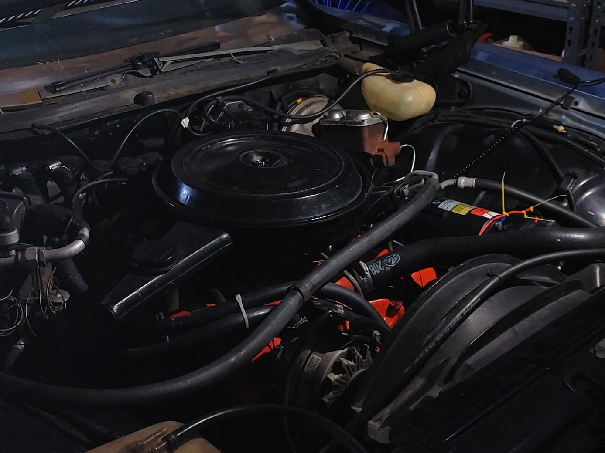

    

## Points to HEI Conversion 
This project outlines converting a 1973 Chevorlet Impala from factory points ignition to a High Engery Ignition. This was done to add some simplification to maintance, allow for removal of the points equipment such that it could be reverted back in the future, and done in a way to make it be equavlent to how the vehicle would have been if HEI had been offered. HEI did not come fully standard until the 1975 model year. 

### Contents
1. [Tools](Tools.md)
2. [Parts](Parts.md)
3. [Process](Process.md)

### Additional Resources 
* On Stop Plates 
([GM Square Body Forum](https://www.gmsquarebody.com/threads/hei-vacuum-advance-stop-plate.43136/)) & ([Internet Archive](https://web.archive.org/web/20240519133052/https://www.gmsquarebody.com/threads/hei-vacuum-advance-stop-plate.43136/))
* On Setting Timing
([GM Square Body Forum](https://www.gmsquarebody.com/threads/ignition-timing-for-first-generation-gm-v-8-engines.14508/)) & ([Internet Archive](https://web.archive.org/web/20240917015607/https://www.gmsquarebody.com/threads/ignition-timing-for-first-generation-gm-v-8-engines.14508/))
* Overview & Notes ([Ray's Chevy Restoration Site](http://rmcavoy.freeshell.org/HEI.html)) & ([Internet Archive](https://web.archive.org/web/20250114162949/http://rmcavoy.freeshell.org/HEI.html))
* Workshop Manuals ([Dave Graham Auto Literature](https://davegrahamauto.com/)) & ([Detroit Iron](https://www.detroitironis.com/))

